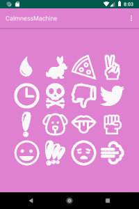
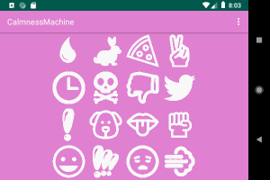
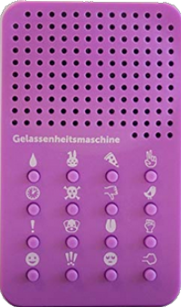

<h1>CalmnessMachine</h1>
Deutsch weiter unten! 

  
 

Stay calm! This Android app lets you choose from 16 ways to say NO: 
1. Moaning 
2. I'll do it, bunny, but first I'll gonna sleep.. 
3. I need pizza! 
4. Nice to have talken about it, but, no! 
5. It's hard, but now it's time to gracefully pass this task on someone else. 
6. Sorry, I've got backache! 
7. Ahem, Nope! 
8. Cuckoo! 
9. Negative! I recap, negative! 
10. No, first I have to dry the dog, harvest the LSD..., otherwise I would have done it. 
11. Get stuffed! 
12. I don't give a shit! 
13. Laughter... 
14. No, no-no-no! 
15. Oh boah! 
16. Fart! 
You can build it with AndroidStudio or find the APK in the app folder. 
 
 
<h1>Gelassenheitsmaschine</h1>

  
 

Bleiben Sie gelassen! Mit dieser Android-App k&ouml;nnen Sie auf 16 unterschiedliche Arten NEIN sagen: 
1. Jammern 
2. Mach' ich Hase, erstmal musss ich schlafen. 
3. Ich will Pizza! 
4. Schön, dass wir dar&uuml;ber gesprochen haben, aber, nein! 
5. Es fällt mir schwer, aber die Zeit ist gekommen, die Aufgabe w&uuml;rdevoll weiterzugeben. 
6. Sorry, ich habe R&uuml;cken! 
7. &Auml;hm, N&ouml;! 
8. Kuck-kuck! 
9. Negativ! Ich wiederhole, negativ! 
10. Nein, ich muss erst den Hund f&ouml;hnen, das LSD ernten..., sonst h&auml;tte ich's gemacht. 
11. Ach, leck' mich! 
12. Mir doch sowas von Schei&szlig; egal! 
13. Lachen... 
14. Nein, nein-nein-nein! 
15. Ach boah! 
16. Pups! 
Sie k&ouml;nnen das Projekt mit AndroidStudio &uuml;bersetzen, oder aber die APK im app-Ordner finden. 

